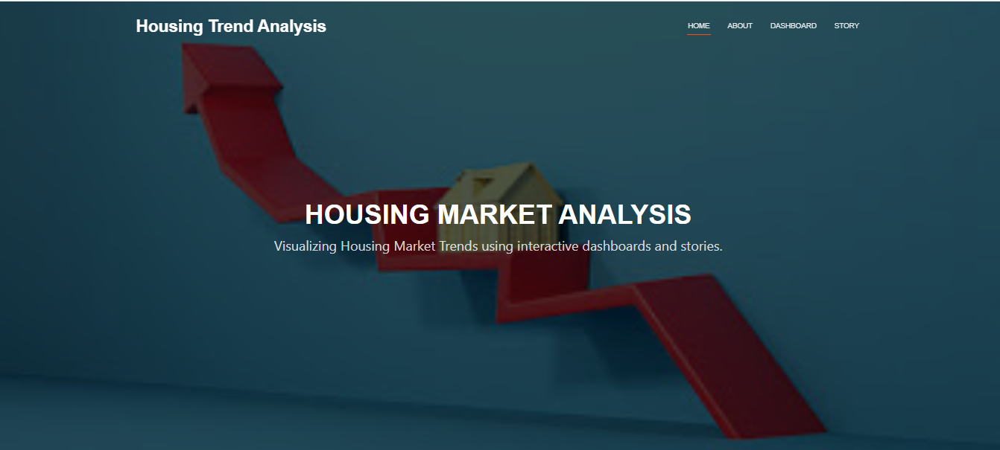
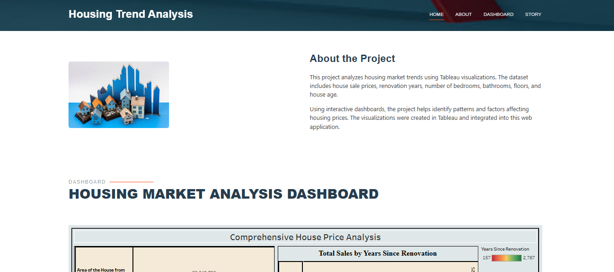
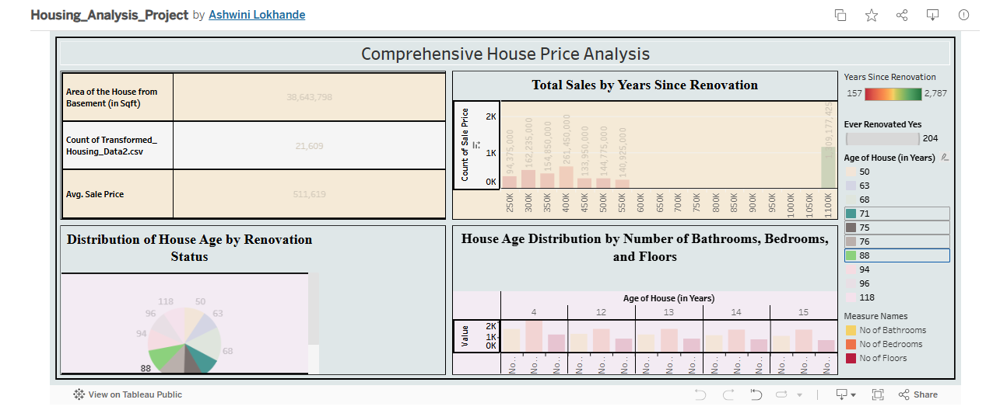
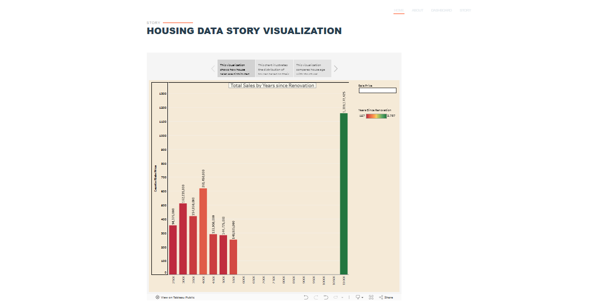

# House-Market-Trends
An interactive data analytics web application that visualizes 
housing market trends using Tableau dashboards integrated 
with a Flask web application.
It aims to address challenges in understanding the factors that influence house prices and sales trends

## Problem Statement
Understanding house price trends is complex due to multiple 
influencing factors like location, size, renovation status and 
age. This project analyzes these factors through interactive 
visualizations to provide meaningful insights into the housing 
market for better decision making.

## About
- Developed an interactive housing market analytics platform using Tableau and Flask to visualize key market trends, pricing factors, and housing characteristics through data-driven dashboards.
- Group Project — Led and completed independently as Team Leader responsible for project planning, dashboard development, and application integration.

## Dataset
- Source: Kaggle (Transformed Housing Data)
- Records: 21,609 houses
- Features: Sale Price, Area (sqft), Bedrooms, Bathrooms, 
  Floors, House Age, Renovation Status

## Screenshots

### Home Page

### About Section

### Dashboard

### Story Visualization

## Dashboard Scenarios
1. **Overall Data Overview** — Key KPIs and metrics
2. **Total Sales by Years Since Renovation** — Renovation impact on price
3. **Distribution of House Age by Renovation Status** — Age analysis
4. **House Age by Bathrooms, Bedrooms, Floors** — Feature relationships

## Live Dashboard
[View on Tableau Public](https://public.tableau.com/app/profile/ashwini.lokhande6396/viz/Housing_Analysis_Project/Dashboard)

## Demo Video
[Watch Project Demo](https://1drv.ms/v/c/ec5278c308fc28f6/IQA2Jk6777dATqiPVTOXm-3QAfjFjkzTILCGIN5yrBPPB8E?e=GOzPn6)

## Tech Stack
- Data Visualization: Tableau Public
- Web Framework: Flask
- Frontend: HTML, CSS, Bootstrap
- Language: Python
- Deployment: Local (Flask Development Server)

## Key Features
- 🏠 Interactive Tableau Dashboard embedded in web app
- 📊 4 analytical scenarios with different visualizations
- 📖 Story visualization for data narrative
- 📱 Responsive design using Bootstrap
- 🎬 Demo video documentation

## How to Run
1. Install dependencies: `pip install flask`
2. Run: `python app.py`
3. Open: `http://127.0.0.1:5000`
